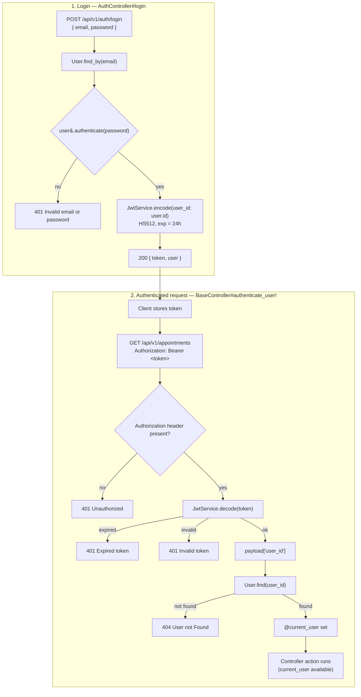
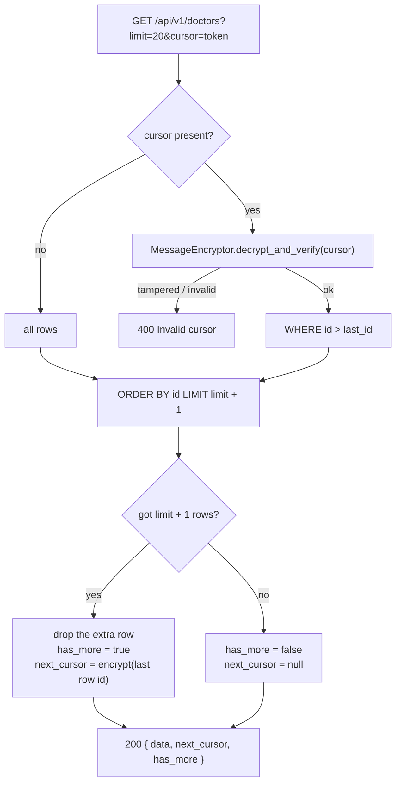

# Clicnica — Patient Clinic API

JSON API for a clinic: patients, doctors, appointments, and user auth (JWT).

## System requirements

| Tool       | Version                                                          |
|------------|------------------------------------------------------------------|
| Ruby       | 3.4.11 (`ruby 3.4.11 (2026-09-23 revision 592f1ffdb3) +PRISM`)   |
| Rails      | 8.1.4                                                            |
| Rack       | 3.2.7                                                            |
| PostgreSQL | 9.5+ (running on `localhost:5432`)                               |
| Bundler    | ships with Ruby                                                  |

Ruby version is pinned in `.ruby-version` (works with mise / rbenv / asdf).

## Setup

```bash
git clone git@github.com:kaushikpuka1998/Clicnica.git
cd Clicnica
bundle install
```

Create a `.env` file in the project root (loaded by `dotenv-rails`):

```bash
PATIENT_CLINIC_API_DATABASE_PASSWORD=your_postgres_password
```

The app connects as the `postgres` user (see `config/database.yml`).

Don't put `DATABASE_URL` in `.env`: it overrides every environment, so the test suite
would run against (and wipe) the development database.

## Database

```bash
bin/rails db:create db:migrate
```

Reset from scratch. In development, `db:drop` / `db:reset` first disconnect other sessions
(DBeaver, the running server) via `bin/rails db:terminate_connections` (`lib/tasks/db.rake`):

```bash
bin/rails db:drop db:create db:migrate
```

### Tables

| Table          | Columns                                                                 |
|----------------|-------------------------------------------------------------------------|
| `users`        | name, email (unique), password_digest, role                             |
| `patients`     | name, email, phone, dob, gender (required)                              |
| `doctors`      | name, email, phone, specialization                                      |
| `appointments` | patient_id → patients, doctor_id → doctors, scheduled_at, status, reason |

## Running the server

```bash
bin/rails server
```

Runs on http://localhost:3000. Health check: `GET /up`.

## API

Base path: `/api/v1`. Request bodies are JSON (`Content-Type: application/json`).

### Auth

| Method | Path                     | Body                                                                 |
|--------|--------------------------|----------------------------------------------------------------------|
| POST   | `/api/v1/auth/register`  | `{ "user": { name, email, password, password_confirmation, role, ...profile fields } }` |
| POST   | `/api/v1/auth/login`     | `{ "email": "...", "password": "..." }`                              |

`role` is `admin`, `doctor` or `patient`. For `doctor` / `patient` the matching profile is created in the
same transaction (`RegisterUser` service), copying `name` and `email` from the user:

| Role      | Extra fields inside `user`            |
|-----------|---------------------------------------|
| `doctor`  | `phone`, `specialization` (all required) |
| `patient` | `phone`, `dob`, `gender` (all required)  |

User and profile are validated together, so one response lists every missing field. Nothing is saved
unless everything is valid:

```json
422 { "errors": ["Doctor phone can't be blank", "Doctor specialization can't be blank", "Email can't be blank"] }
```
Success returns `201` with the user and its `doctor` / `patient` profile.

Login returns a JWT (`HS512`, expires in 24 hours):

```json
{ "message": "Logged in", "token": "<jwt>", "user": { "id": 1, "name": "...", "email": "...", "role": "..." } }
```

Invalid credentials return `401 { "errors": ["Invalid email or password"] }`.

### Authentication flow

Every controller under `Api::V1::BaseController` (patients, doctors, appointments) requires
`Authorization: Bearer <token>`. `AuthController` (register / login) does not.



### Pagination (cursor based)

`GET /api/v1/patients`, `/api/v1/doctors` and `/api/v1/appointments` are paginated with an
**opaque, encrypted cursor**, not page numbers or offsets.

#### Why cursor instead of offset

| | Offset (`?page=5`) | Cursor (`?cursor=...`) |
|---|---|---|
| Query | `OFFSET 80 LIMIT 20`: DB reads and throws away 80 rows | `WHERE id > last_id LIMIT 20`: index jump, same speed on every page |
| Rows inserted/deleted while paging | Rows get skipped or shown twice | Stable, each row appears once |
| Jump to an arbitrary page | Yes | No, only "next page" |

#### Request

| Param    | Default | Notes |
|----------|---------|-------|
| `limit`  | 20      | Page size, clamped to 1–100 |
| `cursor` | none    | `next_cursor` from the previous response. Omit for the first page |

#### Response

```json
{
  "data": [ { "id": 1, "name": "Dr. Amit Sharma" }, { "id": 2, "name": "..." } ],
  "next_cursor": "1g--kUZG9hjvJVFgBCDs--rzqulTwQTlXzUQCi7rmAww",
  "has_more": true
}
```

| Field         | Meaning |
|---------------|---------|
| `data`        | Records for this page, ordered by `id` ascending |
| `next_cursor` | Token for the next page; `null` on the last page |
| `has_more`    | `true` if another page exists |

#### Walking through pages

```bash
# page 1
curl "http://localhost:3000/api/v1/doctors?limit=2" -H "Authorization: Bearer $TOKEN"
# => { "data": [id 1, id 2], "next_cursor": "<token A>", "has_more": true }

# page 2
curl "http://localhost:3000/api/v1/doctors?limit=2&cursor=<token A>" -H "Authorization: Bearer $TOKEN"
# => { "data": [id 3, id 4], "next_cursor": "<token B>", "has_more": true }

# last page
curl "http://localhost:3000/api/v1/doctors?limit=2&cursor=<token B>" -H "Authorization: Bearer $TOKEN"
# => { "data": [id 5], "next_cursor": null, "has_more": false }
```

Keep the same `limit` across pages and stop when `has_more` is `false`.

#### How it works



- **One extra row:** fetching `limit + 1` shows whether a next page exists without a `COUNT(*)` query.
- **Encrypted cursor:** the last id is encrypted with `ActiveSupport::MessageEncryptor` (key derived from
  `secret_key_base`), so clients can't read, guess or edit it. Changing `secret_key_base` invalidates
  old cursors; clients just start again from page 1.
- **Code:** `render_paginated` in `app/controllers/api/v1/base_controller.rb`. Any controller under
  `Api::V1::BaseController` can paginate any scope, e.g. `render_paginated(Doctor.all)` or
  `render_paginated(Appointment.where(doctor_id: params[:doctor_id]))`.

#### Errors

| Case | Response |
|------|----------|
| Cursor edited, truncated or made up | `400 { "error": "Invalid cursor" }` |
| Missing / invalid auth token | `401` (see [Authentication flow](#authentication-flow)) |

### Patients

| Method | Path                    | Body                                                     |
|--------|-------------------------|----------------------------------------------------------|
| GET    | `/api/v1/patients`      |                                                          |
| GET    | `/api/v1/patients/:id`  |                                                          |
| POST   | `/api/v1/patients`      | `{ "patient": { name, email, phone, dob, gender } }`     |

### Doctors

| Method | Path                   | Body                                                     |
|--------|------------------------|----------------------------------------------------------|
| GET    | `/api/v1/doctors`      |                                                          |
| GET    | `/api/v1/doctors/:id`  |                                                          |
| POST   | `/api/v1/doctors`      | `{ "doctor": { name, email, phone, specialization } }`   |

### Appointments

| Method | Path                    | Body                                                                      |
|--------|-------------------------|---------------------------------------------------------------------------|
| GET    | `/api/v1/appointments`  |                                                                           |
| POST   | `/api/v1/appointments`  | `{ "appointment": { patient_id, doctor_id, scheduled_at, status, reason } }` |

Example:

```bash
curl -X POST http://localhost:3000/api/v1/doctors \
  -H 'Content-Type: application/json' \
  -H "Authorization: Bearer $TOKEN" \
  -d '{"doctor":{"name":"Dr. Amit Sharma","email":"amit@example.com","phone":"9876543210","specialization":"Cardiology"}}'
```

## Tests

```bash
bin/rails db:test:prepare test
bin/rails test:system
```

## Code quality

```bash
bin/rubocop         # lint
bin/brakeman        # security static analysis
bin/bundler-audit   # vulnerable gems
```

## CI

GitHub Actions (`.github/workflows/ci.yml`) runs on every push to `main` and on pull requests:
security scans, RuboCop, tests and system tests against a Postgres service container.

## Deployment

Docker + [Kamal](https://kamal-deploy.org) (`config/deploy.yml`, `Dockerfile`). Production needs
`RAILS_MASTER_KEY` and `PATIENT_CLINIC_API_DATABASE_PASSWORD`.
