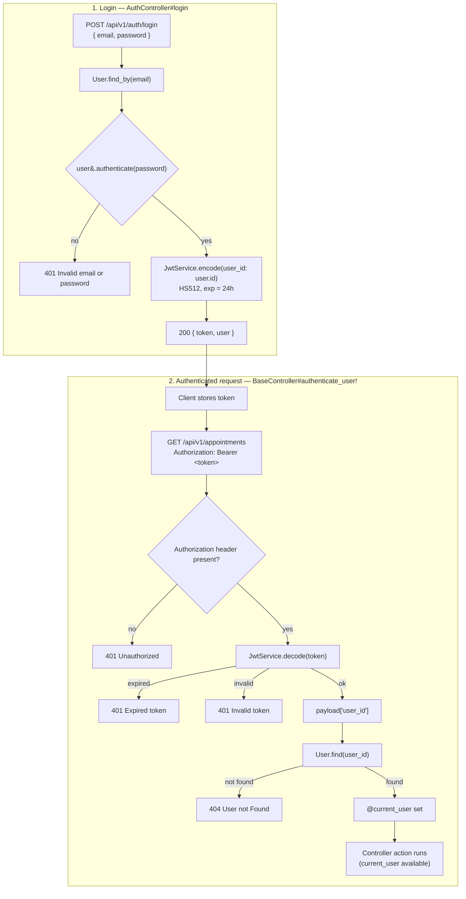

# Clicnica — Patient Clinic API

JSON API for a clinic: patients, doctors, appointments, and user auth (JWT).

## System requirements

| Tool       | Version                                                          |
|------------|------------------------------------------------------------------|
| Ruby       | 3.4.11 (`ruby 3.4.11 (2026-09-23 revision 592f1ffdb3) +PRISM`)   |
| Rails      | 8.1.4                                                            |
| Rack       | 3.2.7                                                            |
| PostgreSQL | 9.5+ (running on `localhost:5432`)                               |
| Bundler    | ships with Ruby                                                  |

Ruby version is pinned in `.ruby-version` (works with mise / rbenv / asdf).

## Setup

```bash
git clone git@github.com:kaushikpuka1998/Clicnica.git
cd Clicnica
bundle install
```

Create a `.env` file in the project root (loaded by `dotenv-rails`):

```bash
PATIENT_CLINIC_API_DATABASE_PASSWORD=your_postgres_password
DATABASE_URL=postgresql://localhost:5432/patient_clinic_api_development
```

The app connects as the `postgres` user (see `config/database.yml`).

## Database

```bash
bin/rails db:create db:migrate
```

Reset from scratch (close DB clients like DBeaver first, or the drop fails with `ObjectInUse`):

```bash
bin/rails db:drop db:create db:migrate
```

### Tables

| Table          | Columns                                                                 |
|----------------|-------------------------------------------------------------------------|
| `users`        | name, email (unique), password_digest, role                             |
| `patients`     | name, email, phone, dob, gender (required)                              |
| `doctors`      | name, email, phone, specialization                                      |
| `appointments` | patient_id → patients, doctor_id → doctors, scheduled_at, status, reason |

## Running the server

```bash
bin/rails server
```

Runs on http://localhost:3000. Health check: `GET /up`.

## API

Base path: `/api/v1`. Request bodies are JSON (`Content-Type: application/json`).

### Auth

| Method | Path                     | Body                                                                 |
|--------|--------------------------|----------------------------------------------------------------------|
| POST   | `/api/v1/auth/register`  | `{ "user": { name, email, password, password_confirmation, role } }` |
| POST   | `/api/v1/auth/login`     | `{ "email": "...", "password": "..." }`                              |

Login returns a JWT (`HS512`, expires in 24 hours):

```json
{ "message": "Logged in", "token": "<jwt>", "user": { "id": 1, "name": "...", "email": "...", "role": "..." } }
```

Invalid credentials return `401 { "errors": ["Invalid email or password"] }`.

### Authentication flow

Every controller under `Api::V1::BaseController` (patients, doctors, appointments) requires
`Authorization: Bearer <token>`. `AuthController` (register / login) does not.



### Patients

| Method | Path                    | Body                                                     |
|--------|-------------------------|----------------------------------------------------------|
| GET    | `/api/v1/patients`      |                                                          |
| GET    | `/api/v1/patients/:id`  |                                                          |
| POST   | `/api/v1/patients`      | `{ "patient": { name, email, phone, dob, gender } }`     |

### Doctors

| Method | Path                   | Body                                                     |
|--------|------------------------|----------------------------------------------------------|
| GET    | `/api/v1/doctors`      |                                                          |
| GET    | `/api/v1/doctors/:id`  |                                                          |
| POST   | `/api/v1/doctors`      | `{ "doctor": { name, email, phone, specialization } }`   |

### Appointments

| Method | Path                    | Body                                                                      |
|--------|-------------------------|---------------------------------------------------------------------------|
| GET    | `/api/v1/appointments`  |                                                                           |
| POST   | `/api/v1/appointments`  | `{ "appointment": { patient_id, doctor_id, scheduled_at, status, reason } }` |

Example:

```bash
curl -X POST http://localhost:3000/api/v1/doctors \
  -H 'Content-Type: application/json' \
  -H "Authorization: Bearer $TOKEN" \
  -d '{"doctor":{"name":"Dr. Amit Sharma","email":"amit@example.com","phone":"9876543210","specialization":"Cardiology"}}'
```

## Tests

```bash
bin/rails db:test:prepare test
bin/rails test:system
```

## Code quality

```bash
bin/rubocop         # lint
bin/brakeman        # security static analysis
bin/bundler-audit   # vulnerable gems
```

## CI

GitHub Actions (`.github/workflows/ci.yml`) runs on every push to `main` and on pull requests:
security scans, RuboCop, tests and system tests against a Postgres service container.

## Deployment

Docker + [Kamal](https://kamal-deploy.org) (`config/deploy.yml`, `Dockerfile`). Production needs
`RAILS_MASTER_KEY` and `PATIENT_CLINIC_API_DATABASE_PASSWORD`.
